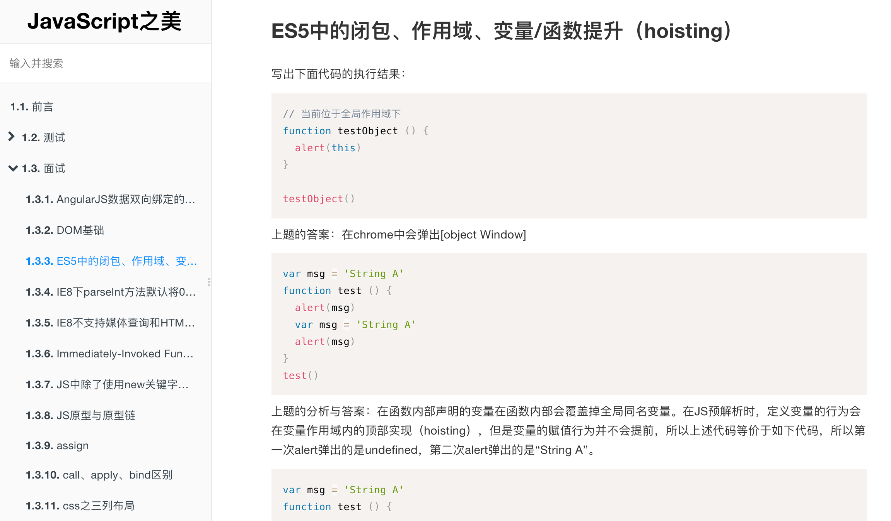

# Equip your GitBook with folding chapters


<p align="center">
  <a href="https://npmcharts.com/compare/gitbook-plugin-folding-chapters?minimal=true">
    
  </a>
  <a href="https://www.npmjs.com/package/gitbook-plugin-folding-chapters">
    
  </a>
  <a href="https://www.npmjs.com/package/gitbook-plugin-folding-chapters">
    
  </a>
</p>


> This plugin will make chapters of your GitBook collapsible.

**This GitBook plugin won't work with the official GitBook default theme, because there are some bugs in that official theme. It's strongly recommended to use the GitBook theme [gitbook-plugin-theme-code](https://www.npmjs.com/package/gitbook-plugin-theme-code) instead of the default theme.**

An example snapshot (GitBook theme used: [gitbook-plugin-theme-code](https://www.npmjs.com/package/gitbook-plugin-theme-code)):




### How to use it?

Add it to your `book.json` configuration:

```
{
    "plugins": ["folding-chapters"]
}
```

Install your plugins using:

```
$ gitbook install
```


### Configuration

There is no configuration needed at the moment, can be left empty.

```
{
	"pluginsConfig": {
		"folding-chapters":{}
	}
}
```

Actually, it's okay for you to ignore the above code -- you do not need to type them.


### Thanks

This plugin is built on base of [gitbook-plugin-expandable-chapters](https://github.com/DomainDrivenArchitecture/gitbook-plugin-expandable-chapters): It seems that plugin didn't fit GitBook default theme since version 3.0.0, at least I found that plugin not available in my gitbook, so I create this plugin you are seeing now on base of that plugin.
